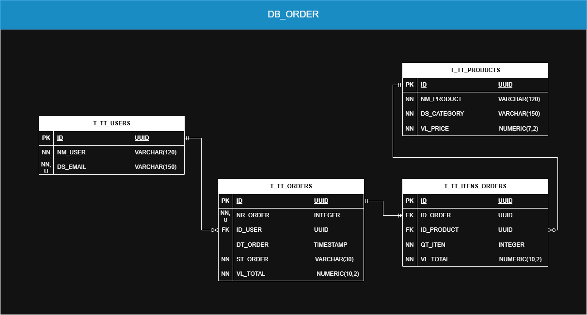

# Estudo de Modelagem e tratamento de dados
Este repositório tem como objetivo o estudo de modelagem e tratamento de dados. Ao longo dos projetos, são explorados conceitos fundamentais de modelagem e tratamentos.

 

*Como funciona esse repositório:*
 
 
Este repositório serve como um espaço para armazenar o código-fonte de diversos projetos. Cada projeto tem como foco o aprimoramento da modelagem e tratamento de dados e desafia o desenvolvedor a aplicar conceitos da linguagem Java em cenários de desenvolvimento prático.

 

*Observações:*

- Projetos desenvolvidos exclusivamente para estudo.

 

# Projetos

<table>
  <tr>
    <td></td>
    <td>
      <h2 style="margin-top: 0; font-size: 24px; color: #333;">Pedidos</h2>
      <h3 style="font-size: 18px; color: #666;">Projeto de tratamento de pedidos</h3>
      
Com base na entrada de dados de pedidos, é necessário normalizar e padronizar as informações para que possam ser integradas de forma consistente à estrutura de dados definida pelo desenvolvedor.

      
Status: Finalizado

      <a href="OrdersInCSV" style="color: rgb(120, 120, 255); text-decoration: none;">Ver código</a>
    </td>
  </tr>

</table>